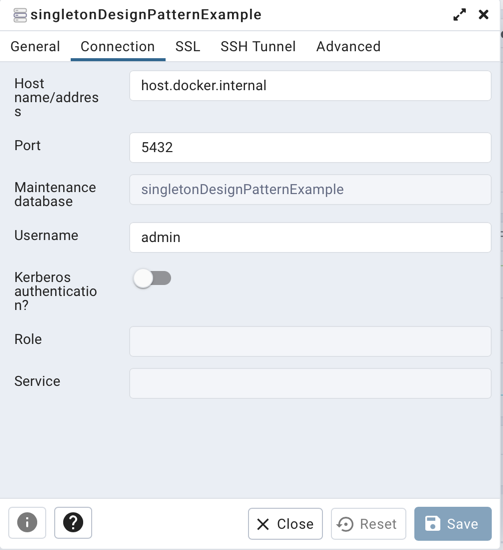

# java-singleton-design-pattern
This is a basic Java project to demonstrate basically how to implement Singleton Design Pattern in Java.

Singleton Design Pattern implementation is explained with two examples. One is plain Singleton Implementation of an object by two ways, eager & lazy instantiation and the other example is from a daily life example which is the implementation of JDBC connection to PostgreSQL DB.

Also, I try to explain how to set up PostgreSQL DB as a container in your local environment below with the required information to run the second example.

## How to Contribute

For the contributor covenant to this project, please check the Code of Conduct file.

[](CODE_OF_CONDUCT.md)

## How to Set up Database

Our database will be run as a container on Docker. So, you need to first set up Docker on your computer.

### How to Set Up Postgres Server

```
docker pull postgres
docker run --name singletonDesignPatternExample -p 5432:5432 -e POSTGRES_USER=admin -e POSTGRES_PASSWORD=admin -e POSTGRES_DB=singletonDesignPatternExample -d postgres
```

### How to Set Up PgAdmin

```
docker pull dpage/pgadmin4
docker run -p 5050:80 --name pgAdmin -e "PGADMIN_DEFAULT_EMAIL=admin@admin.com" -e "PGADMIN_DEFAULT_PASSWORD=admin" -d dpage/pgadmin4
```

You can reach PgAdmin from http://localhost:5050 with the above credentials. Then, you can set up your database as you can see from the below screenshot by registering a server via PgAdmin.
Also, set connection timeout from Advanced tab if required.



Below is the DDL in order to create our table.

```
CREATE TABLE public.apl_user
(
    id uuid DEFAULT gen_random_uuid(),
    username character varying(255),
    password character varying(255),
    PRIMARY KEY (id)
);

ALTER TABLE IF EXISTS public.apl_user
    OWNER to admin;
```